# CNMA Insurance & Claims Consultation Platform

A web application built for **CNMA (Caisse Nationale de Mutualité Agricole)**, an Algerian agricultural insurance provider, to give business decision-makers direct, secure access to insurance contract and claims data — replacing a workflow where this data could previously only be retrieved manually through the IT department.

> Built as an enterprise internship project (ASP.NET MVC), delivered for CNMA's regional structure covering 71 regional branches (CRMA) and 600 local offices.

## The problem

Department heads and decision-makers at CNMA had no direct access to key business data (insurance policies, contracts, claims) — every request had to go through the IT department manually. This slowed down decision-making and reporting.

## The solution

A role-based web application that centralizes contract and claims data into interactive dashboards, searchable tables, and filtered views — so business users can self-serve the data they're authorized to see, without depending on IT for every query.

## Features

- **Secure authentication** — login-only access (no public registration) to keep sensitive company data restricted to authorized staff
- **Role-based access control** — a `Role` attribute per user distinguishes standard users from administrators, who alone can manage accounts
- **Interactive dashboard** — filterable by regional branch (CRMA) and fiscal year (Exercice), covering:
  - Contract summary: capital assuré, cotisation nette, prime commerciale, number of contracts/avenants by insurance branch, with charts
  - Claims summary: open case counts, reserves, settlements, and amounts pending payment (SAP)
- **Contract detail search** — policy number, contract number, policyholder info, effective/expiry dates, net premium, taxes, and guarantee-level breakdown per contract
- **Claims detail search** — claim number, policy number, claim date, case status, reserve/settlement/collection amounts
- **User management (admin only)** — add, edit roles, and delete user accounts

## Tech stack

- **Backend:** ASP.NET MVC, C#, Entity Framework (Code-First migrations)
- **Frontend:** Razor Views, Bootstrap
- **Database:** SQL Server
- **Architecture:** MVC (Model-View-Controller)

Chosen for EF's migration tooling, ASP.NET's built-in security (authentication/authorization, XSS/CSRF/SQL injection protections), and the clean separation of concerns MVC provides for a data-heavy business app.

## Screenshots

**Login** — access restricted to authenticated staff only, no self-registration.

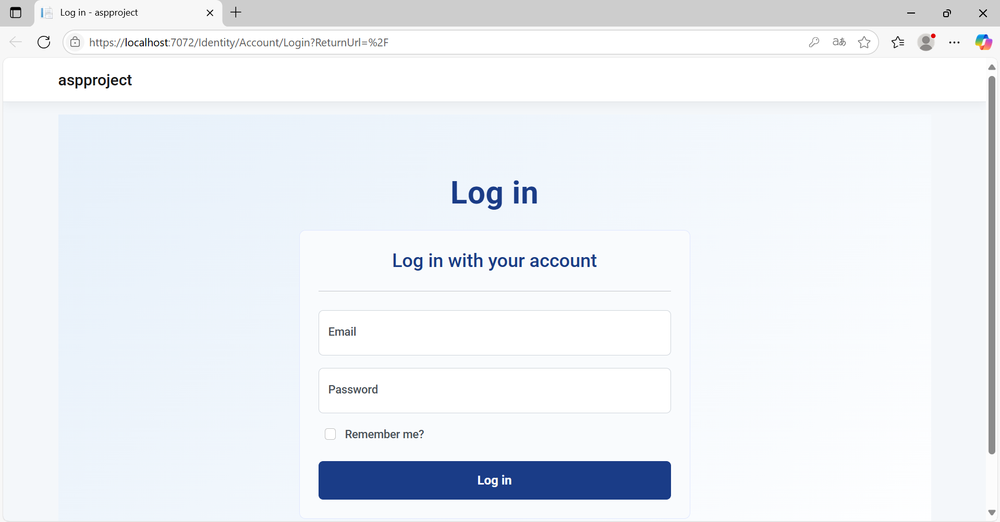

**Homepage** — filter by regional branch (CRMA) and fiscal year (Exercice) before viewing data.

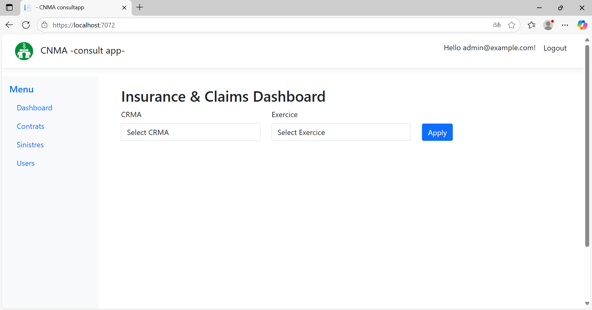

**Dashboard — Contracts recap**

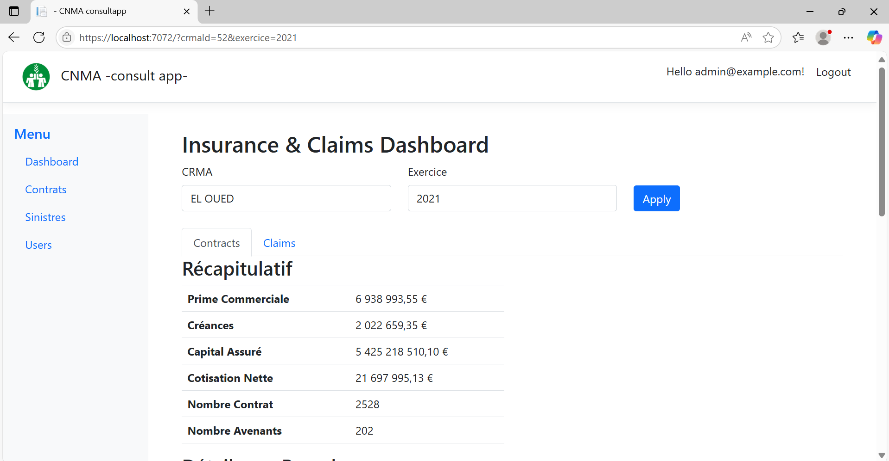

**Dashboard — Contracts, charts and per-branch breakdown**

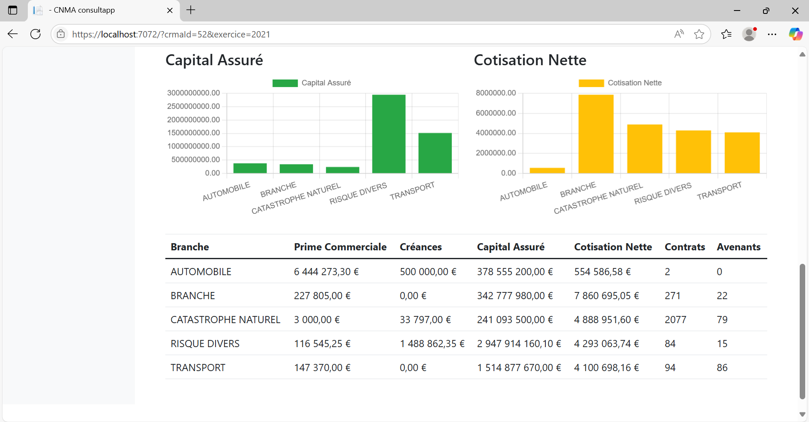

**Dashboard — Claims recap**

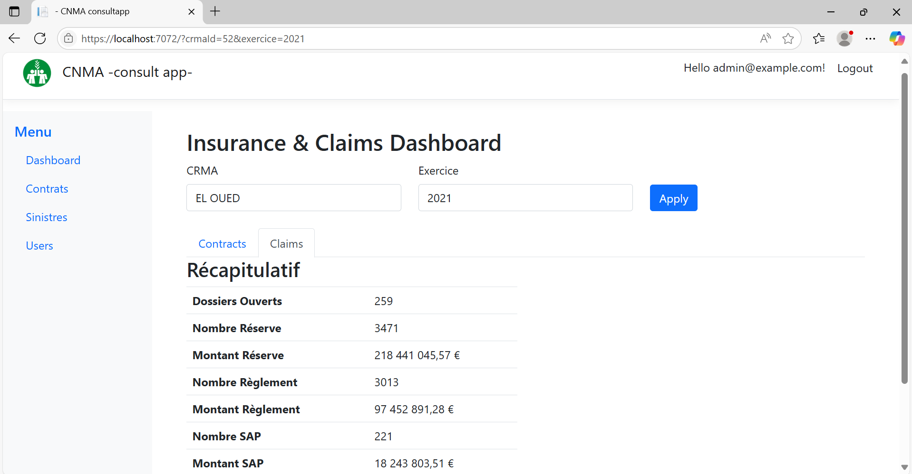

**Contract details table** — searchable by contract number, with per-row detail drill-down.

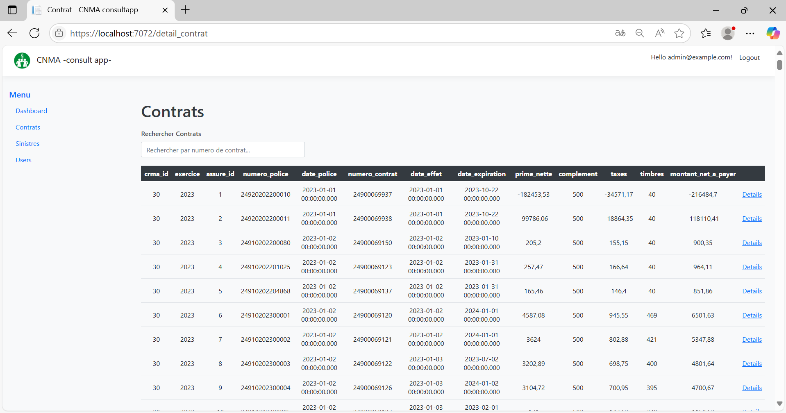

**Contract guarantees** — full guarantee breakdown (capital, majoration, réduction, net premium) per contract.

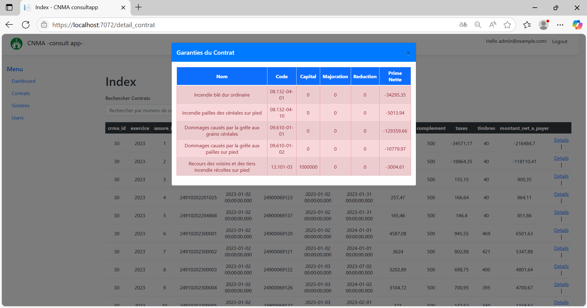
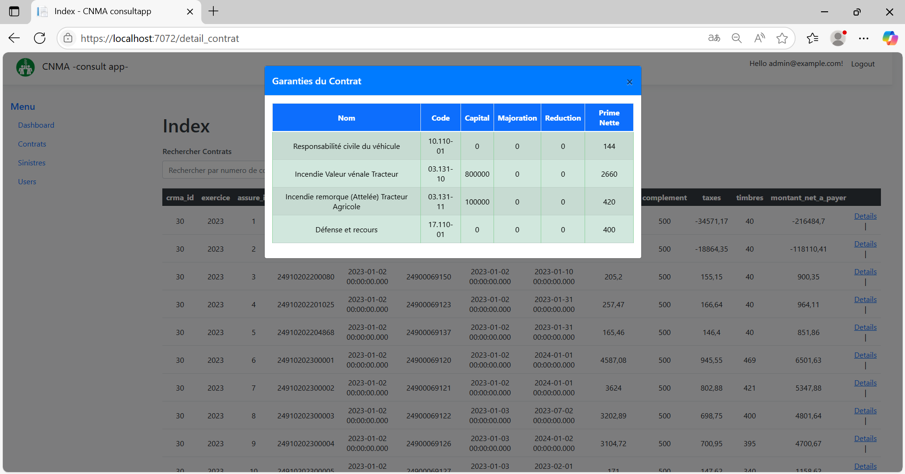

**Claims details table**

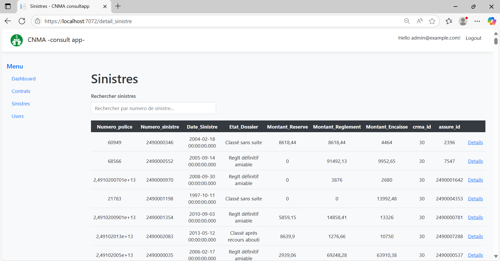

**User management (Admin only)**

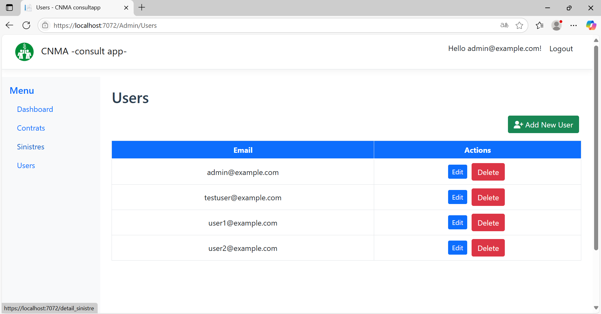
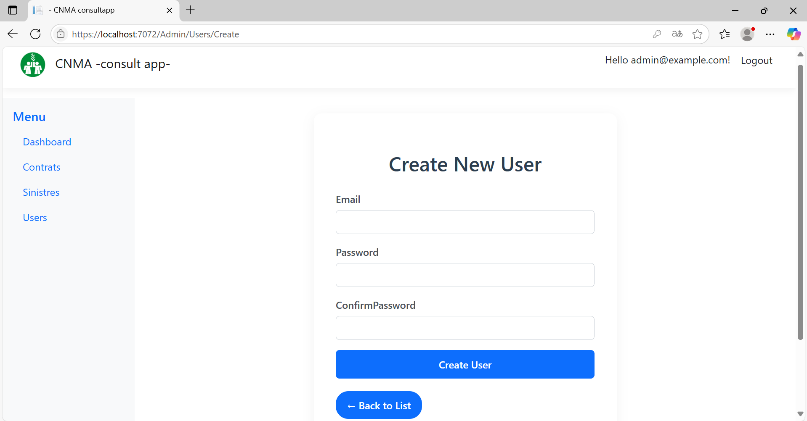
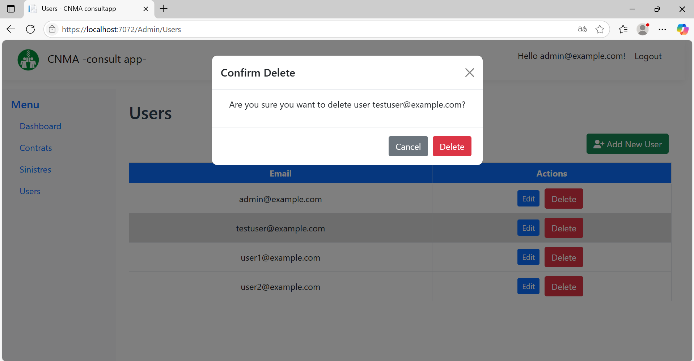
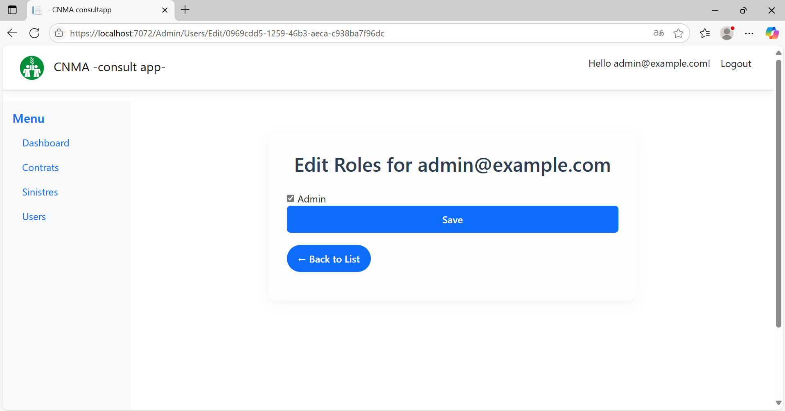

## Author

Built by **Sid Ali Rezzoug** and Samy Belahcene as part of an ASP.NET MVC internship project for CNMA, and presented as a graduation project (Licence in Computer Science, Information Systems & Software Engineering) at Université d'Alger 1.
